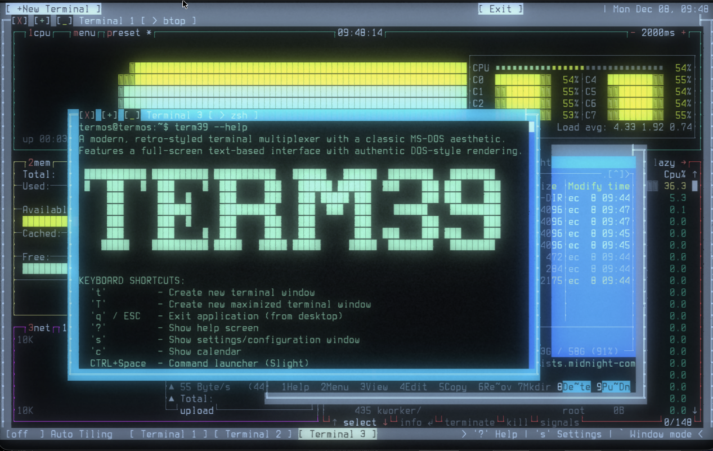
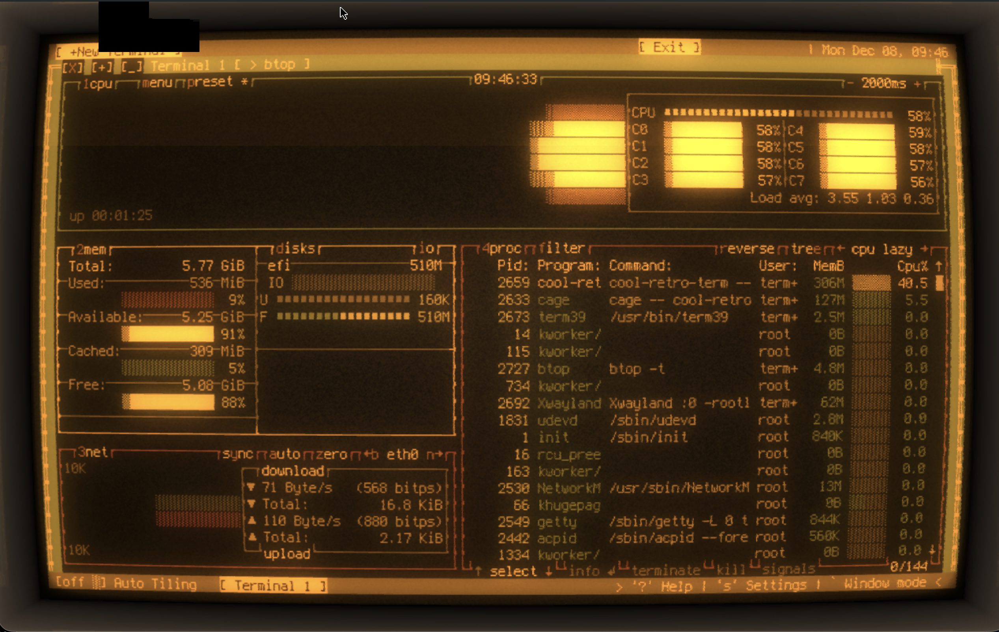
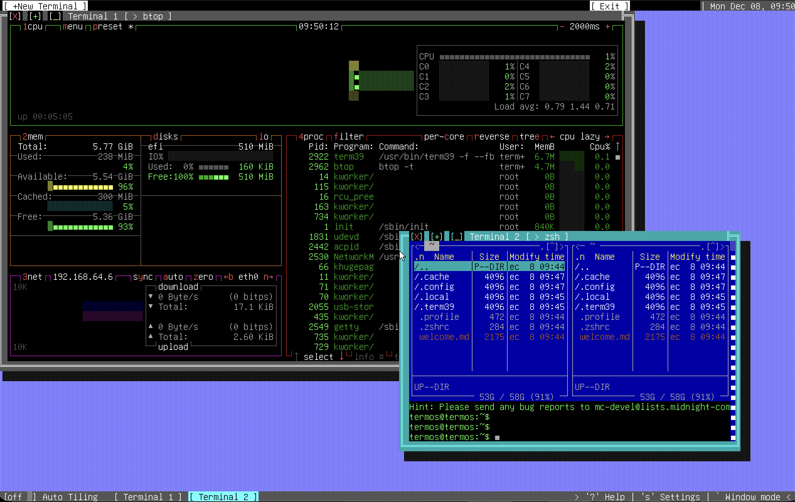
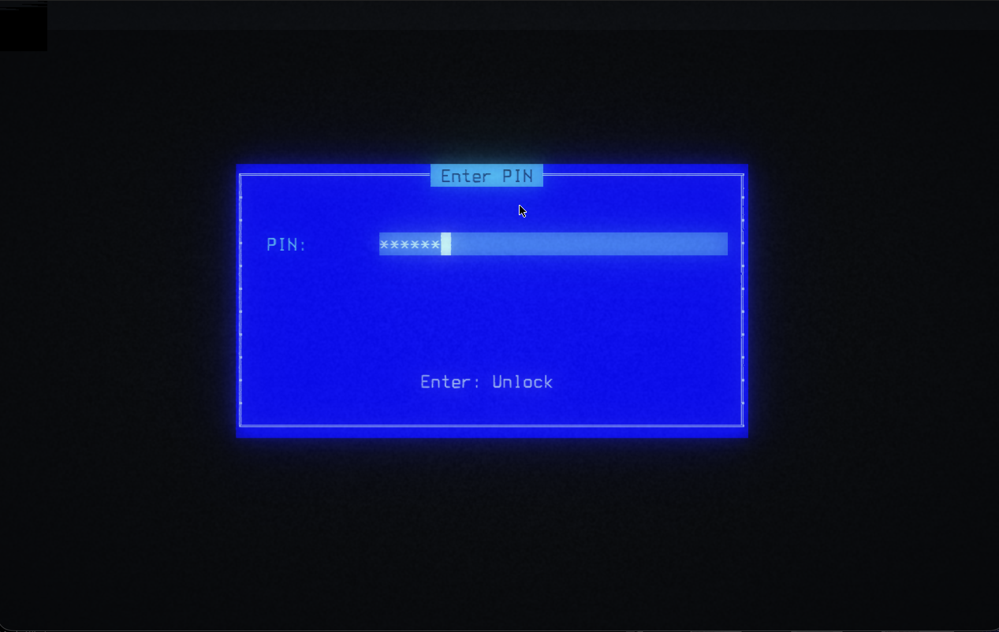
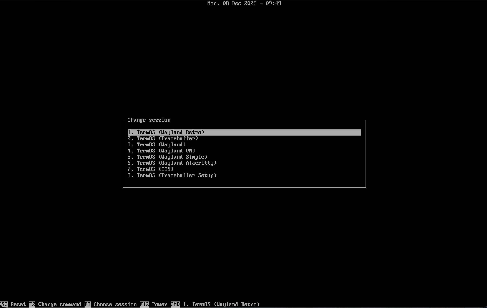
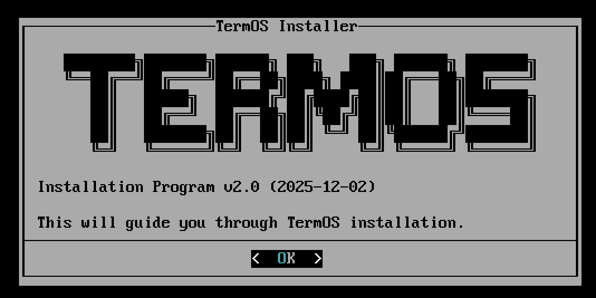

# TermOS

A Linux distribution built around the terminal, using term39 as its main user interface. Supports Wayland, pure TTY text mode and framebuffer text rendering.

## Overview

TermOS is built on Alpine Linux with OpenRC init system, providing a lightweight yet powerful terminal-centric environment. The system boots directly into term39, a full-screen terminal multiplexer designed for productivity.

**Version**: 0.4.0
**Based on**: Alpine Linux 3.23
**Kernel**: Linux LTS 6.18
**Init System**: OpenRC
**Display Manager**: greetd + tuigreet
**Desktop Environment**: term39 v0.20.0

## Screenshots

### term39 Desktop Environment

<p align="center">
  
  <br/>
  <em>term39 with multiple terminals and system monitoring</em>
</p>

### Wayland Retro Session (Default)

<p align="center">
  
  <br/>
  <em>cool-retro-term with authentic CRT scanlines and phosphor glow</em>
</p>

### Framebuffer Mode

<p align="center">
  
  <br/>
  <em>Native framebuffer mode with Midnight Commander file manager</em>
</p>

## Architecture Support

TermOS is available for the following architectures:

### Fully Supported

- **x86_64** (64-bit PC, laptops)

  - BIOS boot (MBR + extlinux/syslinux)
  - UEFI boot (GPT + GRUB2)
  - CPU microcode: Intel and AMD

- **aarch64** (ARM 64-bit, Pi/Laptops)
  - ARM Systems
  - UEFI boot (GPT + GRUB2)

## Installation Options

The `termos-setup` installer provides a guided installation with the following options:

### 1. Disk Selection

- Automatic detection of available disks
- Supports: `/dev/vda`, `/dev/sda`, `/dev/nvme0n1`, `/dev/mmcblk0`
- Displays disk size for verification
- **WARNING**: All data on selected disk will be permanently erased

### 2. Filesystem Selection

Choose between two filesystem options:

| Filesystem | Features                              | Use Case                           |
| ---------- | ------------------------------------- | ---------------------------------- |
| **ext4**   | Traditional, stable, fast             | General use, maximum compatibility |
| **btrfs**  | Modern, snapshots, compression (zstd) | Advanced users, snapshot support   |

**Note**: btrfs uses subvolumes (`@` for root, `@home` for /home) with automatic zstd compression and noatime optimization.

### 3. Disk Encryption (LUKS2)

**EFI systems only** - Full disk encryption using LUKS2

<p align="center">
  
  <br/>
  <em>Term39 passphrase unlock screen</em>
</p>

- **Cipher**: AES-XTS-Plain64
- **Key size**: 512-bit
- **Hash**: SHA-512
- **Iteration time**: 5000ms
- **Type**: LUKS2

**Benefits**:

- Protects data if device is lost or stolen
- Industry-standard encryption
- Boot banner with ASCII art at unlock

**Requirements**:

- Passphrase required at every boot
- Minimum 8 characters recommended
- Not available on BIOS systems (requires GRUB2 with LUKS support)

### 4. Boot Configuration

Automatic bootloader configuration based on firmware:

#### UEFI Systems

- **Bootloader**: GRUB2 (x86_64-efi or arm64-efi)
- **Partition scheme**: GPT
- **EFI partition**: 512MB FAT32
- **Boot entries**: TermOS, TermOS (recovery)
- **Timeout**: 3 seconds
- **Special handling**:
  - Encrypted systems: kernel/initramfs copied to EFI partition (GRUB cannot read LUKS)
  - btrfs systems: kernel/initramfs copied to EFI partition (subvolume compatibility)

#### BIOS Systems (x86_64 only)

- **Bootloader**: Syslinux/Extlinux
- **Partition scheme**: MBR
- **Boot entries**: TermOS, TermOS (recovery)
- **Timeout**: 30 seconds
- **Limitation**: No disk encryption support

### 5. User Account Creation

- Username validation (lowercase letters, numbers, dash, underscore)
- Password with confirmation
- Automatic sudo privileges (wheel group membership)
- Additional groups: video, input, audio, seat, netdev, plugdev
- Default shell: Zsh

### 6. System Configuration

Automatic configuration includes:

- Hostname: `termos`
- Login banner with ASCII art
- System services (eudev, seatd, greetd, NetworkManager)
- Hardware initialization (WiFi unblock, module loading)
- ACPI event handling (brightness, lid close)
- Welcome message for first-time users

## Available Sessions

TermOS provides multiple session types, selectable at login:

<p align="center">
  
  <br/>
  <em>greetd + tuigreet session selector at login</em>
</p>

| Session               | Terminal        | Compositor | Description                              |
| --------------------- | --------------- | ---------- | ---------------------------------------- |
| **Wayland Retro**     | cool-retro-term | cage       | CRT-style terminal with scanlines effect |
| **Framebuffer**       | term39          | none       | Direct framebuffer (80x50 text mode)     |
| **Wayland**           | term39          | cage       | Standard Wayland session with term39     |
| **Wayland VM**        | term39          | cage       | Optimized for virtual machines           |
| **Wayland Simple**    | foot            | cage       | Minimal Wayland with foot terminal       |
| **Wayland Alacritty** | alacritty       | cage       | GPU-accelerated Alacritty terminal       |
| **TTY**               | term39          | none       | Direct TTY (no compositor)               |
| **FB Setup**          | term39          | none       | Framebuffer setup mode                   |

**Default session**: Wayland Retro (for visual appeal)

## Software Stack

### Core System

- **Base**: alpine-base, busybox-extras
- **Kernel**: linux-lts (6.18+)
- **Init**: OpenRC, eudev, dbus
- **Boot**: GRUB2 (EFI), Syslinux (BIOS), mkinitfs
- **Firmware**: linux-firmware (Intel, AMD, WiFi, Bluetooth)

### Encryption & Filesystems

- **Encryption**: cryptsetup, cryptsetup-openrc, device-mapper
- **Filesystems**: btrfs-progs, ext4 (via e2fsprogs)

### Display & Graphics

- **Display Manager**: greetd, greetd-tuigreet
- **Compositor**: cage (Wayland single-app)
- **Wayland Libraries**: wlroots, xwayland, libseat, seatd
- **GPU Drivers**: mesa-dri-gallium
- **Input**: libinput, libinput-udev, xkeyboard-config
- **Fonts**: font-terminus

### Terminal Emulators

- **term39**: Main terminal multiplexer (Rust-based)
- **foot**: Fast Wayland-native terminal
- **alacritty**: GPU-accelerated terminal
- **cool-retro-term**: Vintage CRT-style terminal

### Networking

- **Manager**: NetworkManager, networkmanager-wifi
- **TUI**: networkmanager-tui (nmtui)
- **Utilities**: curl, wget, axel, openssh-client, elinks
- **Firmware**: WiFi drivers for Intel, Realtek, Broadcom, Mediatek, Atheros

### Audio

- **Server**: PipeWire, pipewire-alsa, pipewire-pulse
- **Session Manager**: WirePlumber
- **Utilities**: alsa-utils, pulsemixer
- **Firmware**: sof-firmware (Sound Open Firmware)

### Bluetooth

- **Stack**: bluez, bluez-firmware
- **Service**: bluez-openrc
- **Firmware**: Realtek, Qualcomm Bluetooth

### Hardware Management

- **PCI/USB**: pciutils, usbutils
- **ACPI**: acpi, acpid
- **Power**: upower, pm-utils
- **Sensors**: lm-sensors
- **Storage**: nvme-cli, smartmontools
- **Display**: brightnessctl (backlight control)

### System Tools

- **Disk**: util-linux, sfdisk, parted, dosfstools, e2fsprogs
- **Privilege**: sudo, polkit, polkit-elogind
- **Monitoring**: btop, htop, fastfetch
- **File Manager**: mc (Midnight Commander)
- **Editors**: vim, nano
- **Shell**: zsh (default)
- **Archive**: unzip
- **Utilities**: dialog, less, bat, lsd, tree, viu, git, uv, bc
- **Media**: mpv (video/audio player)

### TermOS-Specific

- **termos-setup**: Interactive installer with dialog-based UI
- **termos-cc**: TermOS Control Center - system configuration utility
- **termos-update**: Term39 update script
- **termos-unlock**: LUKS unlock banner (encrypted systems)
- **Session launchers**: termos-wayland-session, termos-wayland-retro, etc.
- **ACPI handler**: Brightness keys, lid close events
- **Welcome guide**: welcome.md for first-time users

## Installation Process

<p align="center">
  
  <br/>
  <em>termos-setup installer with dialog-based interface</em>
</p>

1. **Boot from ISO**: Boot TermOS installation media (USB or CD)
2. **Login**: Username `root`, no password
3. **Run installer**: Execute `termos-setup`
4. **Follow wizard**: 6 steps with dialog-based interface
   - Step 1: Select disk
   - Step 2: Confirm disk erase + select filesystem
   - Step 3: Configure encryption (EFI only)
   - Step 4: Install base system + bootloader
   - Step 5: Create user account
   - Step 6: System configuration
5. **Reboot**: Remove installation media and reboot
6. **First boot**: Enter encryption passphrase (if enabled), log in

**Installation time**: Approximately 5-10 minutes (depending on disk speed)

## Disk Layout

### UEFI Systems (GPT)

#### Without Encryption

```
/dev/sdX1  512MB   FAT32   /boot/efi  (EFI System Partition)
/dev/sdX2  remainder  ext4/btrfs  /  (Root partition)
```

#### With Encryption (LUKS2)

```
/dev/sdX1  512MB   FAT32   /boot/efi  (EFI System Partition)
/dev/sdX2  remainder  LUKS2   (Encrypted)
			-> cryptroot   ext4/btrfs  /  (Root partition)
```

### BIOS Systems (MBR) - x86_64 only

```
/dev/sdX1  remainder  ext4/btrfs  /  (Root partition, bootable flag set)
```

### btrfs Subvolumes (if btrfs selected)

```
/          subvol=@       compress=zstd,noatime
/home      subvol=@home   compress=zstd,noatime
```

## Risks and Considerations

### Data Loss

- **CRITICAL**: Installation **permanently erases** all data on the target disk
- **No recovery**: Data cannot be recovered after erasure
- **Backup required**: Back up important data before installation

### Encryption Risks

- **Passphrase loss**: If you forget your LUKS passphrase, **data is permanently inaccessible**
- **No backdoor**: There is no password reset or recovery mechanism
- **Boot requirement**: Passphrase must be entered at every boot (no unattended boots)
- **Performance**: Slight CPU overhead for encryption/decryption (usually negligible on modern hardware)

### Filesystem Considerations

- **ext4**: Battle-tested, stable, recommended for most users
- **btrfs**: Newer technology, requires more RAM, experimental features
  - Snapshots require manual configuration
  - Compression may impact performance on older systems
  - Recovery tools less mature than ext4

### Hardware Compatibility

- **GPU**: Requires mesa-dri-gallium support (Intel, AMD, some NVIDIA via nouveau)
- **WiFi**: Depends on linux-firmware support (see Software Stack)
- **Bluetooth**: Requires compatible firmware and kernel drivers
- **ACPI**: Brightness/lid controls require ACPI support (laptops)
- **Virtual Machines**: Use "Wayland VM" session for better compatibility

### System Limitations

- **No BIOS encryption**: LUKS2 only available on UEFI systems
- **Single-user focus**: Optimized for single-user workstations
- **Terminal-centric**: No traditional desktop environment (GNOME, KDE, etc.)
- **Rolling release**: Based on Alpine 3.23 (may have package instability)
- **Manual updates**: Using Alpine apk system packages

### Network Requirements

- **Installation**: Can be done offline from ISO (all packages included)
- **Updates**: Requires internet connection via NetworkManager
- **Repositories**: Uses Alpine 3.23 repositories (https://dl-cdn.alpinelinux.org)

## Recovery Mode

Both bootloaders include a recovery mode:

- **GRUB**: Select "TermOS (recovery)" at boot menu
- **Syslinux**: Select "TermOS (recovery)" at boot menu

Recovery mode boots into single-user mode (runlevel 1) for system repair.

## System Requirements

### Minimum Requirements

- **CPU**: x86_64 or aarch64 processor
- **RAM**: 512MB (1GB+ recommended)
- **Disk**: 4GB (8GB+ recommended)
- **Boot**: UEFI or BIOS (x86_64 only)
- **Display**: Any display supported by Linux kernel (GPU, framebuffer, or serial console)

### Recommended Requirements

- **CPU**: Dual-core 1GHz+
- **RAM**: 4GB+
- **Disk**: 16GB+ (SSD recommended)
- **Boot**: UEFI (for encryption support)
- **Display**: 1920x1080 or higher
- **Network**: WiFi or Ethernet with linux-firmware support

## Post-Installation

After first boot:

1. **Network setup**: Run `nmtui` to configure WiFi/Ethernet
2. **Term39 update**: Run `termos-update` to update term39
3. **Read welcome**: `cat ~/welcome.md` for usage tips
4. **term39 guide**: Press `Ctrl+A ?` in term39 for keybindings
5. **Change session**: Select different session at login (greetd menu)
6. **Alpine packages**: Use apk add/update/upgrade

## Package Versions

Key components included in TermOS v0.3.0 (Alpine 3.23):

| Component              | Version       | Repository | Notes                             |
| ---------------------- | ------------- | ---------- | --------------------------------- |
| **term39**             | 0.20.0-r0     | termos     | Primary desktop environment       |
| **termos-cc**          | 0.1.0-r1      | termos     | TermOS Control Center             |
| **Alpine Linux**       | v3.23         | -          | Rolling release snapshot          |
| **Linux Kernel**       | 6.18.0-r5     | main       | linux-lts package                 |
| **Linux Firmware**     | 20251125-r1   | main       | Complete firmware collection      |
| **OpenRC**             | 0.63-r1       | main       | Init system                       |
| **greetd**             | 0.10.3-r8     | community  | Login manager daemon              |
| **greetd-tuigreet**    | 0.9.1-r0      | community  | TUI greeter for greetd            |
| **cage**               | 0.2.1-r0      | community  | Wayland single-app compositor     |
| **wlroots**            | 0.19.2-r0     | community  | Wayland compositor library        |
| **mesa**               | 25.2.7-r2     | main       | GPU drivers (Intel, AMD, nouveau) |
| **GRUB**               | 2.12-r8       | main       | EFI bootloader                    |
| **Syslinux**           | 6.04_pre1-r19 | main       | BIOS bootloader (x86_64)          |
| **cryptsetup**         | 2.8.1-r0      | main       | LUKS2 disk encryption             |
| **btrfs-progs**        | 6.17.1-r0     | main       | Btrfs filesystem utilities        |
| **e2fsprogs**          | 1.47.3-r0     | main       | ext2/ext3/ext4 utilities          |
| **PipeWire**           | 1.4.9-r2      | community  | Audio server                      |
| **WirePlumber**        | 0.5.12-r0     | community  | PipeWire session manager          |
| **BlueZ**              | 5.85-r1       | main       | Bluetooth stack                   |
| **foot**               | 1.25.0-r0     | community  | Wayland terminal emulator         |
| **alacritty**          | 0.16.1-r0     | community  | GPU-accelerated terminal          |
| **cool-retro-term**    | 1.2.0-r0      | community  | Retro CRT-style terminal          |
| **Midnight Commander** | 4.8.33-r2     | main       | File manager                      |
| **btop**               | 1.4.5-r0      | community  | System monitor                    |
| **vim**                | 9.1.1962-r0   | main       | Text editor                       |
| **zsh**                | 5.9-r7        | main       | Default shell                     |

**Snapshot Date**: December 11, 2025
**Build Date**: December 11, 2025
**Architecture Support**: x86_64, aarch64

Use `apk info -v <package>` on your installed system to check current package versions.

## Community Software

TermOS includes community-contributed terminal applications:

| Tool                                                    | Command       | Alias   | Description                                   | Author                                                   |
| ------------------------------------------------------- | ------------- | ------- | --------------------------------------------- | -------------------------------------------------------- |
| [treemd](https://github.com/Epistates/treemd)           | `treemd`      | `md`    | Terminal markdown viewer with tree navigation | [@nicholasjpaterno](https://github.com/nicholasjpaterno) |
| [gravityfile](https://github.com/Epistates/gravityfile) | `gravityfile` | `files` | Terminal file manager                         | [@nicholasjpaterno](https://github.com/nicholasjpaterno) |
| [dinky](https://github.com/sedwards2009/dinky)          | `dinky`       | `edit`  | Small terminal text editor                    | [@sedwards2009](https://github.com/sedwards2009)         |

## License

TermOS is released under the MIT License. See LICENSE file for details.

All included software retains its original licenses (see SOURCES.txt for complete attribution).

## Support and Resources

- **Repository**: https://github.com/alejandroqh/termos
- **term39**: https://github.com/alejandroqh/term39
- **Alpine Linux**: https://alpinelinux.org
- **Documentation**: See `/usr/share/doc/termos/` on installed systems

## Compliance

TermOS includes GPL-licensed software. Source code availability:

- All sources listed in `SOURCES.txt`
- Alpine Linux packages: https://git.alpinelinux.org/aports
- TermOS-specific scripts: Included in termos-base package
- term39 source: https://github.com/alejandroqh/term39

## Credits

- **TermOS**: Alejandro Quintanar <a@q39.dev>
- **Alpine Linux**: Alpine Linux Development Team
- **term39**: https://github.com/alejandroqh/term39
- **GRUB**: GNU GRUB developers
- **Linux Kernel**: Linux kernel developers
- **See SOURCES.txt for complete attribution**

---

**Version**: 0.4.0 (2025-12-11)
**Installer**: termos-setup v3.0
